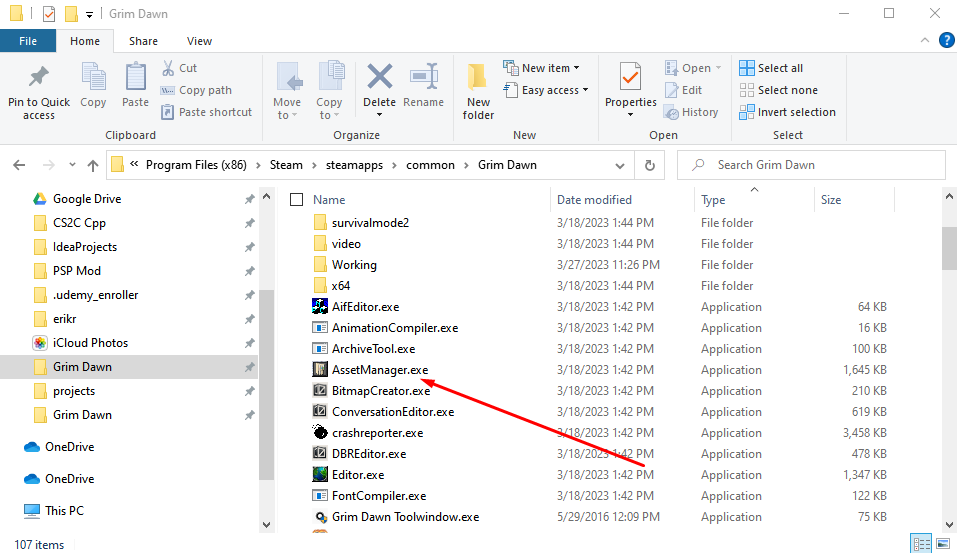
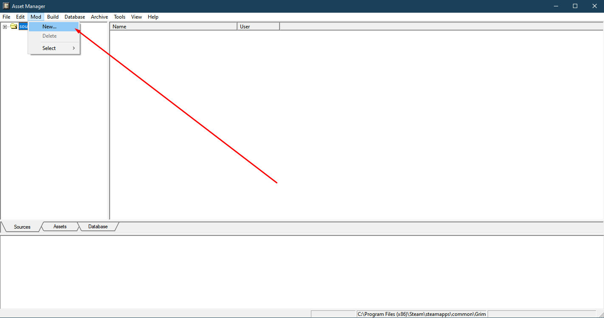
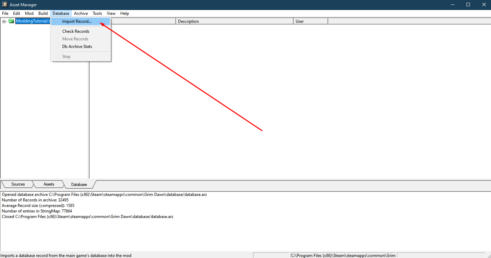
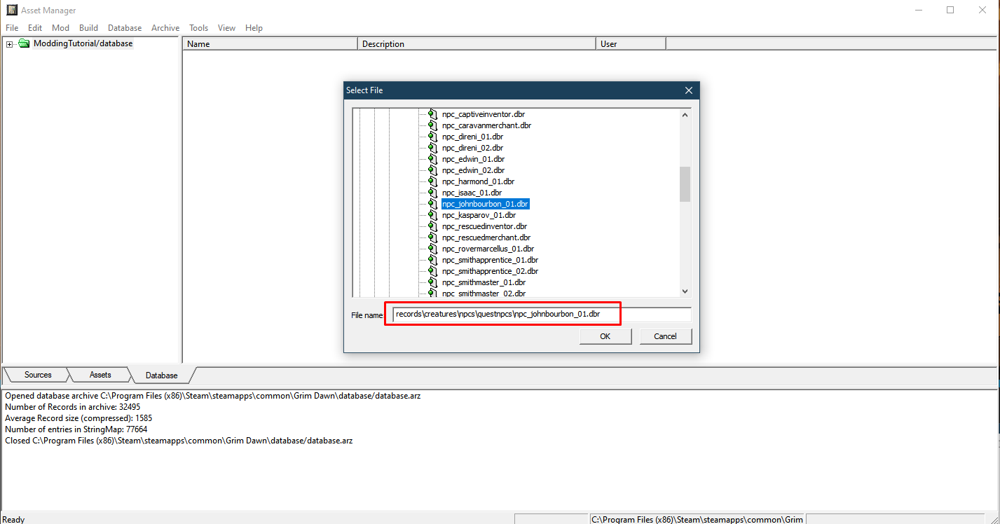
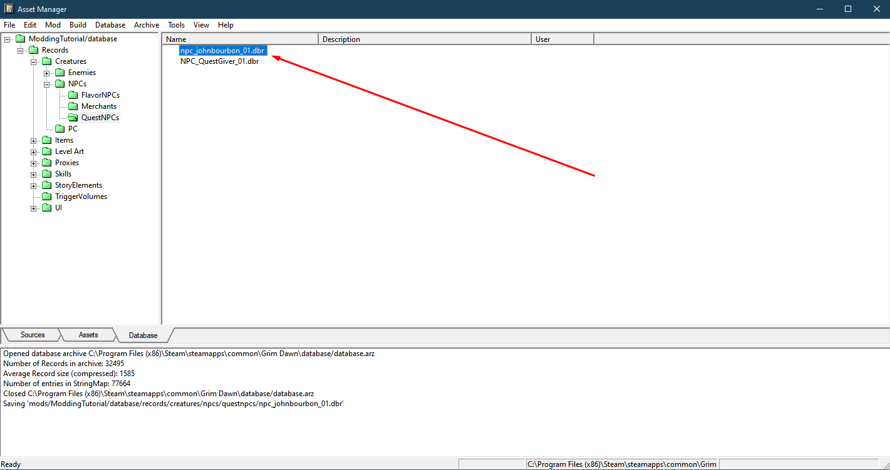

# How to Add and Edit a Single Base Game item or character

For my example I am going to import an NPC called Captain John Bourbon

Importing a database creature record in Grim Dawn using the Asset Manager is a process that can be done in just 7 steps. Here's a step-by-step tutorial on how to do it:

## Step 1: Launch the Asset Manager

First, launch the Asset Manager from the Grim Dawn modding tools. To do this, go to your Steam library, right-click on Grim Dawn, and select "Properties." From there, click on the "Local Files" tab and then click on the "Browse Local Files" button. This will take you to the installation directory for Grim Dawn.

Next, navigate to the "AssetManager" application to launch it.

## Step 2: Create a new mod

Once the Asset Manager is open, you'll need to create a new mod to work with. To do this, click on the "Mod" button in the top-left corner of the window and then "New". Follow the on-screen instructions to create your mod, giving it a name and selecting any other options you want.

## Step 3: Import the record

Go to "Database" at the top Left. Then "Import Record".

## Step 4: Locate the database creature record

Next, locate the database creature record that you want to import into your mod. In my case I'm choosing Captain John Bourbon. This file will have a ".dbr" extension. 

## Step 5: Edit the Record

Now you can continue and modify the item in your own mod as shown by clicking on it.

## Step 6: Build your mod

After you're done changing stats and editing numbers, you'll need to build your mod to make sure that the changes are reflected in the game. To do this, click on the "Build" button in the top-left corner of the Asset Manager window. This will compile all of the assets in your mod and create a new "arz" file.

## Step 7: Launch the game and test the changes

Once your mod has been built, launch Grim Dawn and select your mod from the "Custom Game" menu. Create a new character or load an existing one, and test out the changes you made. If everything worked correctly, the new feature should be present in the game!

